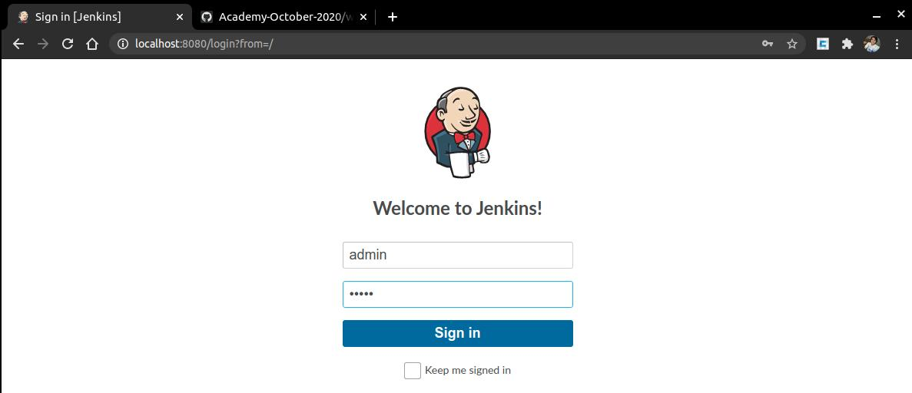
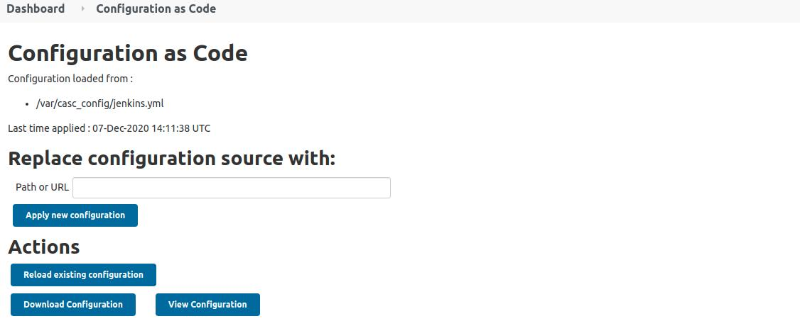
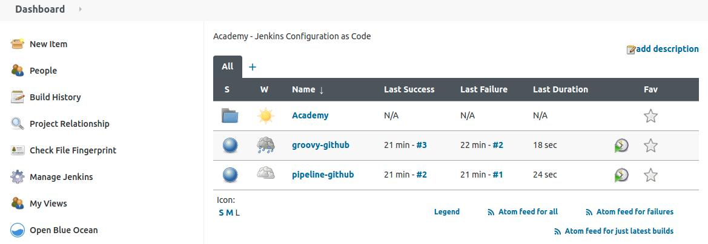

# Jenkins as Code on Docker

This repository contains the files to create an environment with Jenkins, configurating it with code and also the pipelines.

## Prerequisites

* Docker and Docker-compose installed
* Root privileges

## Instructions

### Build the Jenkins environment

1. Download all the files from the repository:

   * `config` folder
   * `image` folder
   * `jobs` folder *(not necessary)*
   * `secrets` folder
   * `docker-compose.yml` file

2. Build and Run Jenkins

   Access to the folder where you have located the files and run the build command, it will take some time to download and create the image:

   ```
   sudo docker-compose build
   ```
   If the build finished successfully, run the up command:
   ```
   sudo docker-compose up
   ```
   

> Note: it is important to preserve the repo structure, otherwise you should modify the paths in the config files.

***

### Accessing Jenkins

Once the container is running, you can access Jenkins through the URL: `http://localhost:8080/` in your browser.
By default, the `admin` user is **admin** and the password is set as in the `secrets/admin_pass` file that you can modify later.

On the other hand, **GitHub credentials** can be edited in the files: `secrets/github_user` and `secrets/github_pass`

  

***

### Configuration as Code

You can apply new configuration to Jenkins:
* editing `config/jenkins.yml` file 
* and then load the changes in Jenkins `http://localhost:8080/configuration-as-code/` clicking `Reload existing configuration`

  

If the screen shows an error Jenkins doesn't stop and the canges are not loaded so, you can fix the modifications or discard them.

***

### Run a Pipeline

There are 3 pipelines preloaded in the `config/jenkins.yml` file that you can see in the dashboard.
* 2 are pointing to a GitHub repository
* 1 is set in the same file.

  
